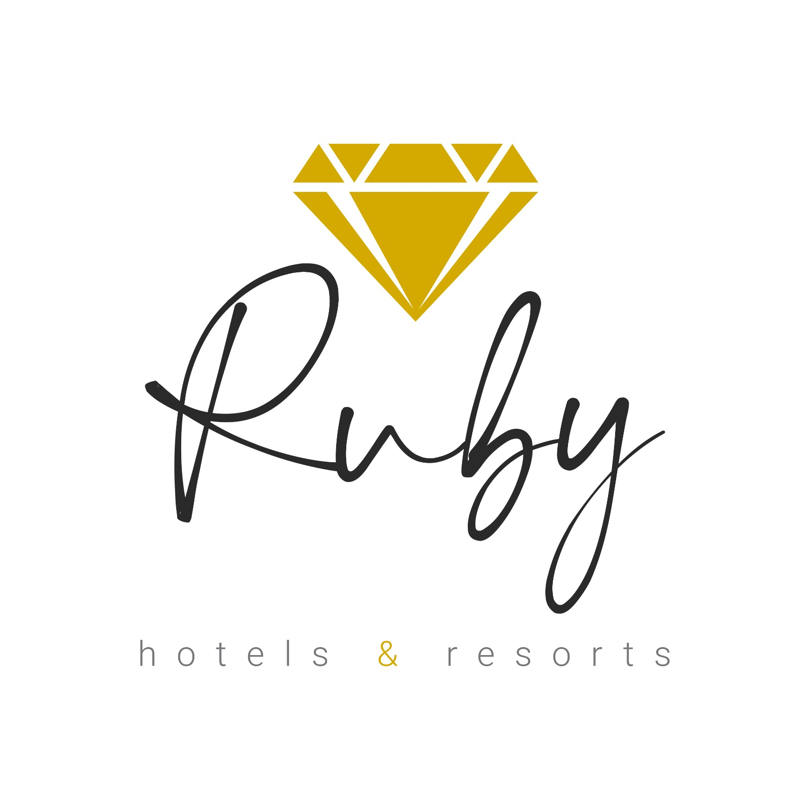

<a name="readme-top"></a>

<div align="center">
  
  <br/>

  <h3><b>Ruby Resorts BE</b></h3>

</div>

<!-- TABLE OF CONTENTS -->

# 📗 Table of Contents

- [📖 About the Project](#about-project)
  - [🛠 Built With](#built-with)
    - [Tech Stack](#tech-stack)
    - [Key Features](#key-features)
  - [🚀 Live Demo](#live-demo)
- [💻 Getting Started](#getting-started)
  - [Setup](#setup)
  - [Prerequisites](#prerequisites)
  - [Install](#install)
  - [Usage](#usage)
  - [Run tests](#run-tests)
  - [Deployment](#triangular_flag_on_post-deployment)
- [👥 Authors](#authors)
- [🔭 Future Features](#future-features)
- [🤝 Contributing](#contributing)
- [⭐️ Show your support](#support)
- [🙏 Acknowledgements](#acknowledgements)
- [📝 License](#license)

<!-- PROJECT DESCRIPTION -->

# 📖 Ruby Resorts BE <a name="about-project"></a>


**Ruby Resorts BE** is the Back End project for Ruby Resorts Final Capstone Project.

- [API Documentation](./readme-res/API.md)
- [Frontend repository](https://github.com/anthonymr/ruby-resorts-frontend)


## 🛠 Built With <a name="built-with"></a>

### Tech Stack <a name="tech-stack"></a>

  <ul>
    <li><a href="https://rubyonrails.org/">Ruby</a></li>
    <li><a href="https://www.ruby-lang.org/">Rails</li>
    <li><a href="https://www.postgresql.org/">PotsgreSQL</li>
  </ul>

<!-- Features -->

### Key Features <a name="key-features"></a>

- **Authentication API**
- **User management API**
- **Room reservation API**

<p align="right">(<a href="#readme-top">back to top</a>)</p>

<!-- LIVE DEMO -->

## 🚀 Live Demo <a name="live-demo"></a>

- Live demo is hosted in [Render](comingsoon)


<p align="right">(<a href="#readme-top">back to top</a>)</p>

<!-- GETTING STARTED -->

## 💻 Getting Started <a name="getting-started"></a>


To get a local copy up and running, follow these steps.

### Prerequisites

In order to run this project you need the following installed in your local machine:

<ul>
<li>Ruby</li>
<li>Rails</li>
<li>PostgreSQL</li>
<li>Github Account</li>
</ul>

### Setup

Clone this repository to your desired folder:

```sh
  cd <desired-folder>
  git clone https://github.com/anthonymr/ruby-resorts-backend
  cd ruby-resorts-backend
```

### Install

Install this project with:

```sh
  bundle install
```

The above command installs necessary gems used in the project

### Usage

To run the project, execute the following command:

```sh
  npm rails s
```

The above command starts the rails server.

### Run tests

To run tests, run the following command:

```sh
  rspec spec
```

we have added Rspec test cases for all models and API endpoints in the project.

### Deployment

You can run server production mode with this command:

```sh

  RAILS_ENV=production rails s

```

<p align="right">(<a href="#readme-top">back to top</a>)</p>

<!-- AUTHORS -->

## 👥 Authors <a name="authors"></a>


👤 **Anthony Martin**

- GitHub: [@anthonymr](https://github.com/anthonymr)
- Twitter: [@Anthony2Martin](https://twitter.com/Anthony2Martin)
- LinkedIn: [Anthony Martin](https://www.linkedin.com/in/anthony-martin-rodriguez/)

👤 **Raphael Okolo**

- GitHub: [@RaphDasilva](https://github.com/RaphDasilva)
- Twitter: [@silvaz_creation](https://twitter.com/silvaz_creation)
- LinkedIn: [Raphael (Nnaemeka) Okolo](https://www.linkedin.com/in/raphael-okolo-480012227/)


<p align="right">(<a href="#readme-top">back to top</a>)</p>

<!-- FUTURE FEATURES -->

## 🔭 Future Features <a name="future-features"></a>

- [ ] **Allow admin user to add new hotels and cities**
- [ ] **Allow users to cancel reservations**

<p align="right">(<a href="#readme-top">back to top</a>)</p>

<!-- CONTRIBUTING -->

## 🤝 Contributing <a name="contributing"></a>

Contributions, issues, and feature requests are welcome!

Please log any bugs or issues in [issues page](https://github.com/anthonymr/ruby-resorts-backend/issues).

<p align="right">(<a href="#readme-top">back to top</a>)</p>

<!-- SUPPORT -->

## ⭐️ Show your support <a name="support"></a>

If you like this project, please give a Star to the [github repo](https://github.com/anthonymr/ruby-resorts-backend)

<p align="right">(<a href="#readme-top">back to top</a>)</p>

<!-- ACKNOWLEDGEMENTS -->

## 🙏 Acknowledgments <a name="acknowledgements"></a>

We would like to thank [Murat Korkmaz on Behance](https://www.behance.net/gallery/26425031/Vespa-Responsive-Redesign) for the design.

<p align="right">(<a href="#readme-top">back to top</a>)</p>


<!-- LICENSE -->

## 📝 License <a name="license"></a>

This project is [MIT](./LICENSE) licensed.

<p align="right">(<a href="#readme-top">back to top</a>)</p>
